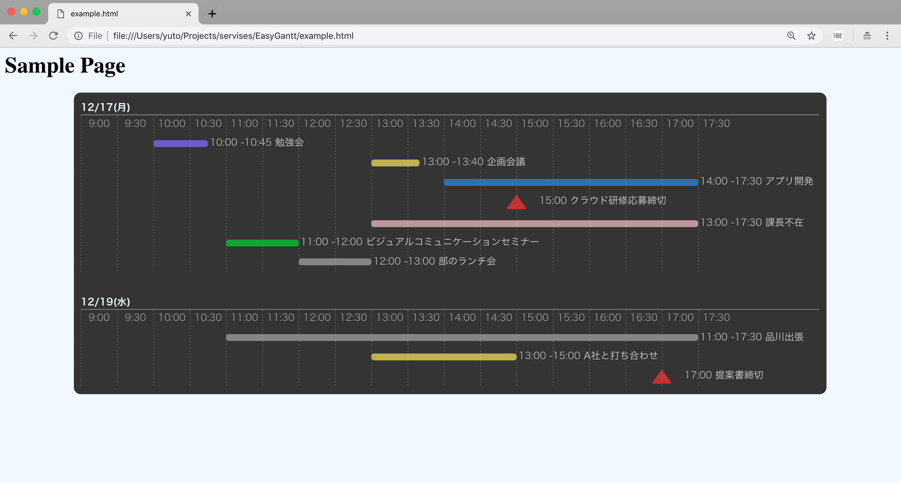

## What's EasyGantt.js

カラフルなバブルで近日中の予定やマイルストンを可視化できるツールです。

簡単なコピペですぐに導入できます。

サーバを必要としないためブラウザのみで動作し、bootstrapやjQueryといったライブラリと依存関係がありません。インターネットのない環境でも動作します。

分単位での予定の可視化にフォーカスしているため、短いスパンでの予定管理に向いています。

依存関係を表示する機能などはなく、予定のみシンプルに可視化します。

コードは[こちら](https://github.com/tachibanayu24/EasyGantt.js){:target="_blank"}。


[demoページ](https://tachibanayu24.github.io/EasyGantt.js/example.html){:target="_blank"}

## How To Use

1. easygantt.jsの編集

`easygantt/easugantt.js`に、次の値を入力してください。

* 何日から開始するか
* 何時から何時までを表示するか

サンプル画像のようにする場合は、次の通りになります。
```javascript
// 開始する日付を入力してください
let startDay = {
  year: 2018,
  month: 12,
  day: 17
}

// 始業時間と就業時間を入力してください(30分単位で入力してください)
// 以下は、9:00から17:30を表示する場合
let openingTime = 900;
let closingTime = 1730;
```

入力した値に応じて、日付や時間軸の部分が変わります。
時間軸は。30分単位で分割して表示します。

次に、`easygantt/tasks.js`の配列に、予定するタスクを記入してください。

何もタスクがない日は、空の配列としてください。

```javascript
let task = [
// 1日目
[
  // 1日目のタスクその1
  {
    name: "勉強会",
    startTime: 1000,
    endTime: 1045,
    category: "event"
  },
  // 1日目のタスクその2
  {
    name: "企画会議",
    startTime: 1300,
    endTime: 1340,
    category: "meeting"
  },
  // 1日目のタスクその3
  {
    name: "アプリ開発",
    startTime: 1400,
    endTime: 1730,
    category: "dev"
  },
  // 1日目のタスクその4
  {
    name: "クラウド研修応募締切",
    startTime: 1500,
    endTime: 1500,
    category: "milestone"
  },
  // 1日目のタスクその5
  {
    name: "課長不在",
    startTime: 1300,
    endTime: 1730,
    category: "absence"
  },
  // 1日目のタスクその6 時系列順である必要はありません
  {
    name: "ビジュアルコミュニケーションセミナー",
    startTime: 1100,
    endTime: 1200,
    category: "lecture"
  },
  // 1日目のタスクその7
  {
    name: "部のランチ会",
    startTime: 1200,
    endTime: 1300,
    category: "other"
  },
],
// 2日目 タスクがない場合は配列はからのまま
[],
```

`category`は次の7種類が用意されており、バブルの色と対応します。

 `dev 開発関係業務`

 `lecture レクチャーやセミナー`

 `meeting 会議`

 `event 何らかのイベント`

 `absence 誰かの不在予定`

 `other その他のタスク`

 `milestone 何かの期限`

milestoneは特別な`category`です。
バブルは表示せず、三角形で期限を示します。

## Get Start

cloneして、JSとCSSを読み込み、任意の場所にHTMLタグを挿入してください。

```
$ git clone https://github.com/tachibanayu24/EasyGantt.js.git
```

```html
<link rel="stylesheet" href="easygantt/easygantt.css">
<script type="text/javascript" src="easygantt/easygantt.js"></script>
<script type="text/javascript" src="easygantt/tasks.js"></script>

~~~~~~

<div id="easygantt"></div>
```

# Reference Material

EasyGantt.jsのCSSは、[Timesheet.js](https://sbstjn.com/timesheet.js/)を参考にしています。